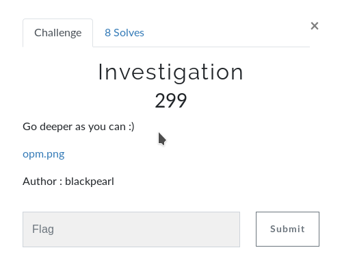

# Investigation
<p align="center">

</p>

## Walkthrough
So after downloading the image. The first obvious thing i did is seeing the image
<p align="center">

</p>
It's Saitama from One punch man, one of my favorite animes.
There was nothing suspicious in the visual image itself so i printed the strings using

```
strings opm.png
```

I noticed at the end of the strings there is a data:image base64.
so i saved this base64 in different file and named it opm.txt
i then decoded the base64 to image using this commande
```bash
cat opm.txt | base64 -d > output.jpg
```

i got this image
<p align="center">

</p>
It's our friend saitama yet again with some wise quotes !
Nothing in the visual form of the picture.
Tried strings yet again.
And this poped 

```
JFIF
$3br
%&'()*456789:CDEFGHIJSTUVWXYZcdefghijstuvwxyz
	#3R
&'()*56789:CDEFGHIJSTUVWXYZcdefghijstuvwxyz
QKF+
4QE;
3mZ"
9ETq
```

From my little experience, there may be some hidden files using steghide
```bash
steghide extract -sf output.jpg
```
It asked for a password. I struggeled there but i was able to find it. It's obvious ! the password is password.

And i got a text file named base64.txt containing 
```bash
@PBKX13.;OFF,`L1i6Sb?YD690OI:'EaNEYDLD
```

It's base85 (wow), decoding it gives us the flag

## Flag

b00t2root{1_4m_@_h3r0_F0r_fUn}

