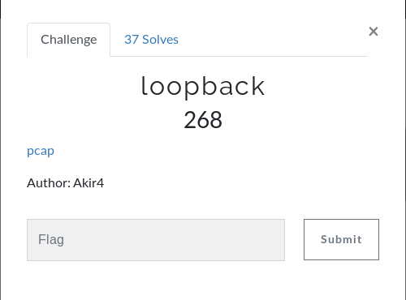
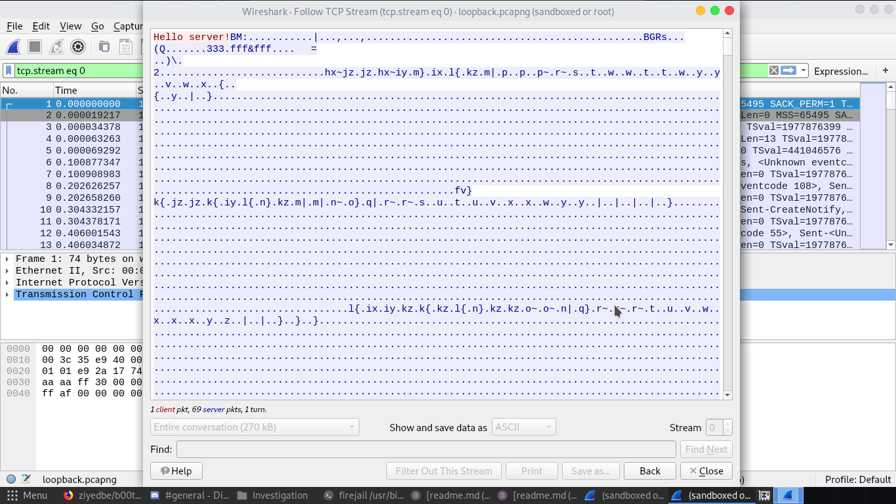
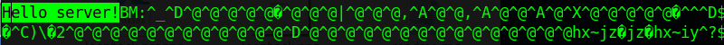
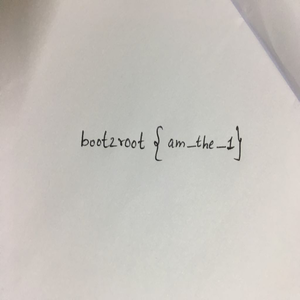
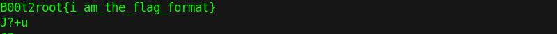

# loopback

## Walkthrough
It's a pcap file so the first obvious thing to do was wireshark
I directly followed the tcp stream and saved the raw data to a file.

I then tried to modify the file.
I deleted the "Hello server!" line from it.

And hop ! now i have an image.

I opened the image and read the flag.
But it wasn't in the right form.
Seeing the strings of the pcapng file i found the flag format

## Flag
B00t2root{am_the_1}

