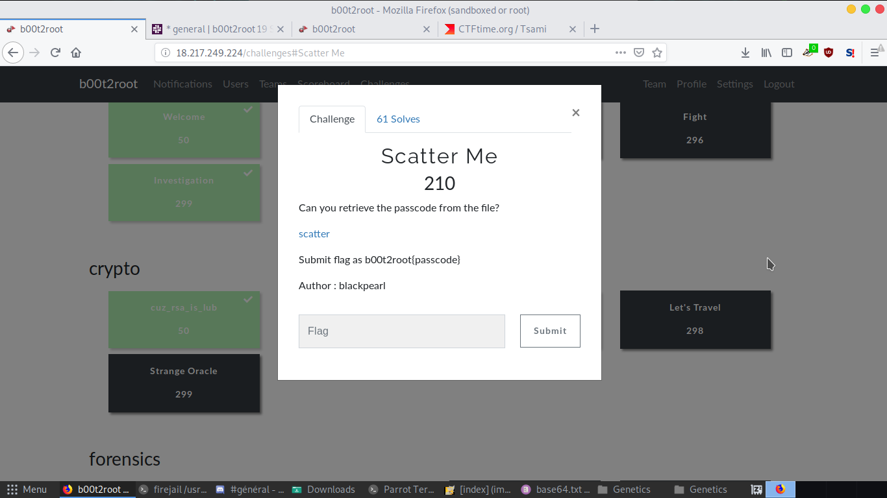
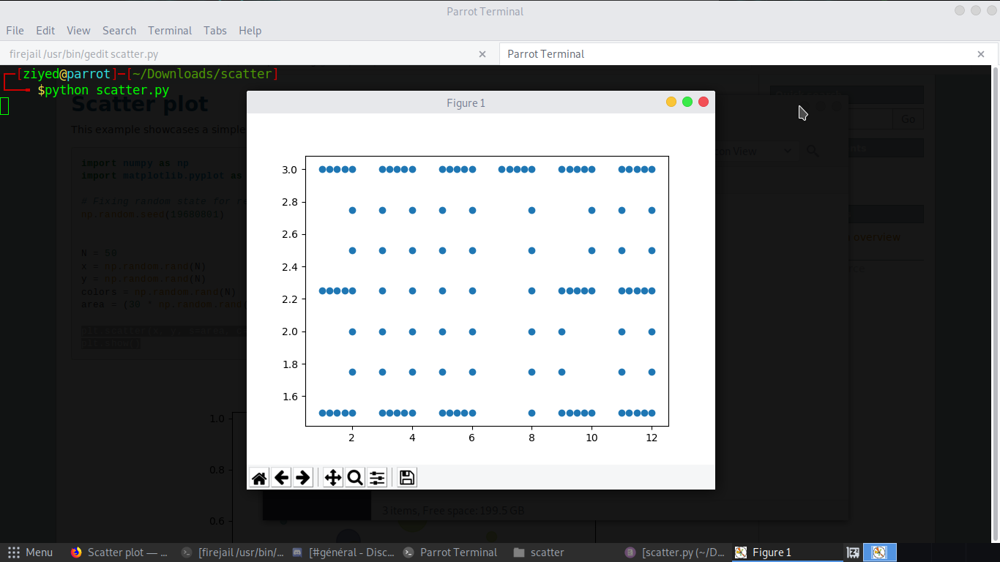

# Scatter Me
<p align="center">

</p>

## Python Script
```python
import numpy as np
import matplotlib.pyplot as plt
def scatter():
	f = open("scatter.txt","r")
	content=f.readlines()[0]
	ch=content.split(";")
	x=[]
	y=[]
	for i in ch:
		x.append(float(i.split(':')[0]))
		y.append(float(i.split(':')[1]))
	plt.scatter(x,y)
	plt.show()
	
scatter()
```

## Output

<p align="center">

</p>

## Flag

b00t2root{300728}
